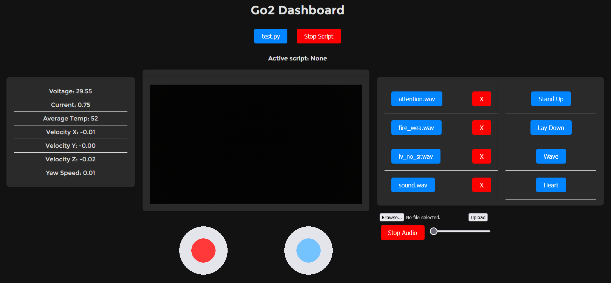

# Go2 Dashboard



A nice little dashboard to access your Unitree Go2 through a web interface that allows you to:
- See stats about the dog like velocity or yaw speed
- Get a live camera feed
- Remotely start/stop scripts on your computer
- Upload and play sound effects through the dog

Uses [Legion1381's fork of the Unitree Python SDK](https://github.com/legion1581/go2_python_sdk2/tree/dev)

## Code Setup (Local Machine)

**Prerequisites:**
Ensure CMake and Python 3 are installed on your system.

**Install CycloneDDS:**
```bash
cd ~
git clone https://github.com/eclipse-cyclonedds/cyclonedds -b releases/0.10.x 
cd cyclonedds && mkdir build install && cd build
cmake .. -DCMAKE_INSTALL_PREFIX="~/cyclonedds/install"
cmake --build . --target install
export CYCLONEDDS_HOME="~/cyclonedds/install"
```

**Create and Activate a Virtual Environment:**
- **Windows:**
  ```bash
  python -m venv .venv
  .venv/Scripts/activate
  ```
- **Linux:**
  ```bash
  python3 -m venv .venv
  source .venv/bin/activate
  ```

**Install Dependencies:**
```bash
pip install -r requirements.txt
```

**Start Dashboard:**
```bash
python app.py
```
